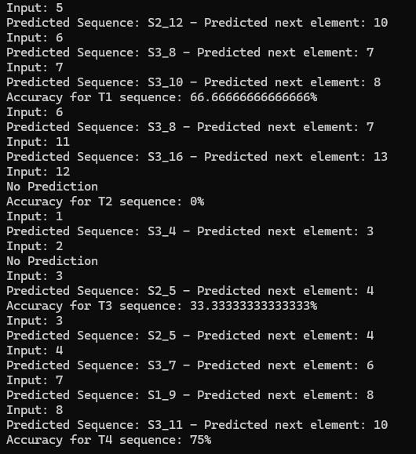

# ML23/24-09   Approve Prediction of Multisequence Learning 

## Introduction

Multisequence learning has a broad range of applications across multiple disciplines, such as finance, bioinformatics, natural language processing, and sensor networks. For example, MSL methods have proven crucial in computational biology to understand the intricate regulatory systems controlling genomic sequences, protein interactions, and gene expression. Similar to this, MSL models in financial markets can predict stock prices, spot trading opportunities, and better manage portfolio risks by taking use of the dependencies between various financial time series. In this project, we provide a comprehensive overview of Multisequence Learning, covering its theoretical foundations, algorithmic methodologies, and practical applications. We discuss the key challenges associated with learning from multiple sequences and highlight the unique opportunities afforded by this paradigm. Our Project can learn the previous sequence and predict the future sequence. We have trained the project and got some output It gives good accuracy
 
## Implementation

Experiment Flow: The experiment begins by reading the input sequences, followed by the training phase where the HTM model learns the patterns within these sequences. After training, the model attempts to predict future elements of the sequences, and the results are compiled into a report detailing the prediction accuracies.

Data Handling: The project uses JSON files for input and output data. Input sequences are read from specified JSON files, and the prediction results are outputted as a text report.

Customization: You can adjust the HTM parameters and experiment settings within HelperMethods.cs to cater to different sequence patterns or experiment with different HTM configurations.


The model used to process and store the dataset is called `Sequence`. And as shown below:

```csharp
public class Sequence
{
    public String name { get; set; }
    public int[] data { get; set; }
}
```

eg:
- Dataset

```json
[
  {
    "name":"S1","data":[0,2,4,5,6,7,8,9,11,13,14,15,16,19]
  },

  {
    "name":"S2","data":[0,1,2,4,5,10,12,13,14,15,16,17,18,19]
  },
  {
    "name":"S3","data":[0,1,3,4,6,7,8,10,11,13,16,17,18,19]
  }

]
```

- Test Dataset

```json
[
  {
    "name": "T1",
    "data": [ 5, 6, 7, 8 ]
  },
  {
    "name": "T2",
    "data": [ 6, 11, 12, 13 ]
  },
  {
    "name": "T3",
    "data": [ 1, 2, 3, 4 ]
  },
  {
    "name": "T4",
    "data": [ 3, 4, 7, 8, 10 ]
  }
]


```
1. Program.cs 
This file serves as the application's entry point. It orchestrates reading input datasets, runs the multi-sequence learning experiment, and generates reports.
Key Functions of program.cs
  Main(): Initiates the sequence learning experiment and report generation.

	ReadDataset(): Reads sequences from a JSON file into a list of Sequence objects.

	WriteReport(): Generates a text file report summarizing the prediction accuracies of the learned sequences.

You can be found [here](../Program.cs):

  1.1. CalculateAccuracy()
  
  ```csharp
//Summary
//Accuracy is calculated as number of matching predictions made 
//divided by total number of prediction made for an element in subsequence
//accuracy = number of matching predictions/total number of prediction * 100
//Summary
int matchCount = 0;
int predictions = 0;
double accuracy = 0.0;

foreach (var item in list)
{
    Predict();
    //compare current element with prediction of previous element
    if(item == Int32.Parse(prediction.Last()))
    {
        matchCount++;
    }
    predictions++;
    accuracy = (double)matchCount / predictions * 100;
}
```

2.	MultiSequenceLearning.cs
This file contains the core logic for setting up the HTM model, training it with sequences, and using it for predictions.
Key Functions of this file: 
Run(): Configures and initializes the HTM model, then starts the sequence learning experiment.
RunExperiment(): Orchestrates the learning process, including encoding input sequences, training the HTM model, and making predictions.

You can be found [here](../MultisequenceLearning.cs):


3.	HelperMethods.cs
This file provides utility functions to support the main experiment logic, such as HTM configuration, dataset handling, and encoder setup.
Key Functions:
	FetchHTMConfig: Generates an HTM configuration based on specified parameters.
	GetEncoder: Initializes and returns an encoder for input value encoding.
	ReadDataset: Utility function to read and deserialize sequences from a file.

You can be found [here](../HelperMethods.cs):

  3.1. FetchHTMConfig()

We save the HTMConfig, which is utilized for Hierarchical Temporal Memory, to 'Connections'.

```csharp
public static HtmConfig FetchHTMConfig(int inputBits, int numColumns)
{
    return new HtmConfig(new int[] { inputBits }, new int[] { numColumns })
    {
        Random = new ThreadSafeRandom(42),

        CellsPerColumn = 25,
        GlobalInhibition = true,
        LocalAreaDensity = -1,
        NumActiveColumnsPerInhArea = 0.02 * numColumns,
        PotentialRadius = (int)(0.15 * inputBits),
        MaxBoost = 10.0,
        DutyCyclePeriod = 25,
        MinPctOverlapDutyCycles = 0.75,
        MaxSynapsesPerSegment = (int)(0.02 * numColumns),
        ActivationThreshold = 15,
        ConnectedPermanence = 0.5,e.
        PermanenceDecrement = 0.25,
        PermanenceIncrement = 0.15,
        PredictedSegmentDecrement = 0.1,
    };

}
```

All of the fields are self-explanatory according to HTM theory.

  3.2. getEncoder()

We used 'ScalarEncoder' because we were encoding solely numeric values. Remember, 'inputBits' is the same as 'HTMConfig'.


```csharp
/// <summary>
/// Get the encoder with settings
/// </summary>
public static EncoderBase GetEncoder(int inputBits)
{
    var settings = new Dictionary<string, object>
    {
        { "W", 15 },
        { "N", inputBits },
        { "Radius", -1.0 },
        { "MinVal", 0.0 },
        { "Periodic", false },
        { "Name", "scalar" },
        { "ClipInput", false },
        { "MaxVal", MaxScalarValue }
    };

    return new ScalarEncoder(settings);
}
```
Here the `MaxValue` for the encoder is set to `20`, it can be changed but must be matched when producing the synthetic dataset.

  3.3. ReadDataset()

When supplied as a whole path, this function reads the JSON file and returns an object from the `Sequence` list.

```csharp
/// <summary>
/// Reads dataset from the file
/// </summary>
public static List<Sequence> ReadDataset(string path)
{
    Console.WriteLine("Reading Sequence...");
    try
    {
        string fileContent = File.ReadAllText(path);
        return JsonConvert.DeserializeObject<List<Sequence>>(fileContent);
    }
    catch (Exception ex)
    {
        Console.WriteLine($"Failed to read the dataset: {ex.Message}");
        return new List<Sequence>(); // Return an empty list in case of failure
    }
}
```
  3.4. SaveDataset()
This Function is useing for saving dataset to the file. 
```csharp
  /// <summary>
/// Saves dataset to the file
/// </summary>
public static string SaveDataset(List<Sequence> sequences)
{
    string basePath = AppDomain.CurrentDomain.BaseDirectory;
    string datasetFolder = Path.Combine(basePath, "dataset");
    Directory.CreateDirectory(datasetFolder); // CreateDirectory is safe to call if directory exists
    string datasetPath = Path.Combine(datasetFolder, $"dataset_{DateTime.Now.Ticks}.json");

    Console.WriteLine("Saving dataset...");
    File.WriteAllText(datasetPath, JsonConvert.SerializeObject(sequences));
    return datasetPath;
}
```
  3.5. CreateSequences()
This is use to write Report to the file. 

```csharp
/// <summary>
/// Writes report to the file
/// </summary>
public static List<Sequence> CreateSequences(int count, int size, int startVal, int stopVal)
{
    return Enumerable.Range(1, count).Select(i =>
        new Sequence
        {
            name = $"S{i}",
            data = GenerateRandomSequence(size, startVal, stopVal)
        })
        .ToList();
}
```

  3.6. SaveDataset()

For Generating Random Sequence.


```csharp
 private static int[] GenerateRandomSequence(int size, int startVal, int stopVal)
 {
     var rnd = new Random();
     var sequence = new HashSet<int>();

     while (sequence.Count < size)
     {
         int number = rnd.Next(startVal, stopVal + 1);
         sequence.Add(number);
     }

     return sequence.OrderBy(n => n).ToArray();
 }
```
4. Sequence.cs and Report.cs
	Sequence.cs Defines the structure for sequences used in the experiment, including the sequence name and data. You can be found [here](../Report.cs):

	Report.cs: Structures the format for reports generated after running experiments, containing details like sequence name, data, prediction log, and accuracy. You can be found [here](../Sequence.cs):


Observe that there is no prediction code.

## How to set up and run the project
Prerequisites
	.NET development environment such as Visual Studio
	.Net Sdk 8.0 or greater
	Access to NuGet package manager
Required Libraries
	NeoCortexApi: Core library for HTM functionalities.
	Newtonsoft.Json: Used for handling JSON serialization and deserialization.

## Installation Steps
1.	Save the project project on your computer.
2.	Open the solution file in Visual Studio.
3.	Restore NuGet packages to ensure all dependencies are correctly installed.
4.	Build the solution to verify that everything is set up correctly.

## How to run the project
1.	Navigate to the Program.cs file, which serves as the entry point of the application.
2.	Ensure the input datasets are correctly placed in the designated folder (as specified in Program. cs).
3.	Run the project. The console application will execute the sequence learning experiment and generate a report on prediction accuracy.


## Results
We have used a range of datasets to do as much experimentation as is practical. We purposely kept the dataset sizes small and the sequence lengths short in order to account for the significant execution time.


## Reference

- Forked from [ddobric/neocortexapi](https://github.com/ddobric/neocortexapi)

- [Numenta Research Publication](https://www.numenta.com/resources/research-publications/) 

- [Machine Learning Guide to HTM](https://www.numenta.com/blog/2019/10/24/machine-learning-guide-to-htm/)
